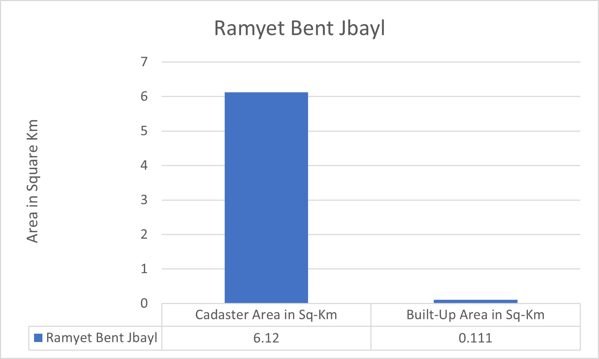

# 🗺️ Urban Footprint Mapping – Ramyet Cadastre (Bint Jbeil, Lebanon)

## 📍 Overview
This project presents a GIS-based mapping of the urban footprint in **Ramyet village**, located in the **Bint Jbeil District** of southern Lebanon. The work was conducted during my GIS work at **UN-Habitat Lebanon** using **QGIS** and satellite imagery provided by **Bing Maps**.

The goal was to visualize the **extent of built-up areas** within the cadastre for potential use in post-conflict analysis, urban planning, and humanitarian research. The mapping was completed during the **September 2024 war in Lebanon**, although the satellite imagery was captured **before the conflict**.

---

## 🎯 Objective
The urban footprint layer may support:
- Monitoring war impact or damage to the built environment
- Estimating density of construction vs. total land
- Pre/post-conflict spatial assessments
- Humanitarian or reconstruction planning

---

## 🛠 Tools & Methods
- **Software**: QGIS
- **Imagery**: Bing Satellite Imagery (pre-war)
- **Technique**: Manual digitization of built-up areas using QGIS editing tools
- **Source Layer**: Cadaster boundary shapefile for Ramyet

## 🧪 Methodology

The goal of this project was to manually digitize the urban footprint (built-up areas) in the village of **Ramyet**, located in the Bint Jbeil district of southern Lebanon.

### Workflow:
1. **Data Preparation**  
   - Imported the cadastral boundary shapefile for Ramyet into QGIS.
   - Loaded Bing satellite imagery as a base layer using XYZ Tiles.

2. **Digitizing**  
   - Used QGIS editing tools to manually trace built-up areas (houses, buildings, structures).
   - Each polygon was added to a new layer named `ramyet_footprint`.

3. **Area Calculation**  
   - Calculated surface area of each polygon using QGIS field calculator (in km²).
   - Summed total built-up area and compared it to total cadaster area.

4. **Export & Visualization**  
   - Took two screenshots from QGIS showing:
     - The Bing satellite image with the Ramyet cadastre boundary.
     - The digitized built-up polygons over the satellite base.
   - Saved the screenshots as PNG images and added them to the `Maps/` folder.
   - Included the final digitized shapefile (with `.shp`, `.shx`, `.dbf`, `.prj`) in the `Data/` folder for demonstration purposes.

### Key Stats:
- **Total Cadastre Area**: 6.120 km²  
- **Built-up Area**: 0.111 km²  
- **Urbanization Ratio**: ~1.81%

---

## 📐 Area Statistics
| Area Type       | Value (km²) |
|-----------------|-------------|
| Total Cadastre  | 6.120       |
| Built-up Area   | 0.111       |
| Built-up Ratio  | ~1.81%      |

These figures were calculated from manually digitized polygons using the QGIS field calculator and zonal statistics.

---

## 📚 Supporting Documents

The `Docs/` folder contains additional reference materials and visuals used in this project:

- `lebanon_cadasters_attributes.xlsx`: Full attribute table for all cadastres in Lebanon.
- `ramyet_cadaster_info.xlsx`: Specific attribute data for Ramyet cadastre.
- `ramyet_area_barchart.jpg`: A bar chart comparing:
  - Total area of Ramyet cadastre (6.120 km²)
  - Digitized built-up area (0.111 km²)

These documents support the area calculation results and help contextualize the urbanization level within the village boundary.

### 📊 Area Comparison Bar Chart

---

## 🧭 Outputs
- A shapefile representing the urban footprint (`Data/` folder)
- Screenshot maps (`Maps/` folder)
- Project documentation in this README

---

## 📂 Folder Structure

---

## 🔒 Note on Data Use
This digitization is based on **public satellite imagery** and is **not linked to confidential datasets**. The work was performed as part of a supervised work and is presented here in a **reconstructed, portfolio-appropriate format**.

---

## 👤 About Me
**Bassem Jaafar Naser Aldine**  
Master's in Surveying Engineering – Lebanese International University  
📧 Bassem Naser Aldine | 🌐 www.linkedin.com/in/bassem-naser-aldine-402b0165

